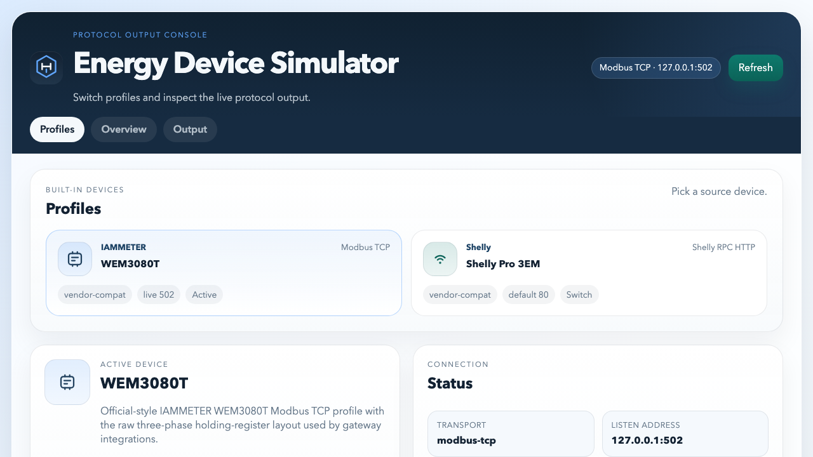
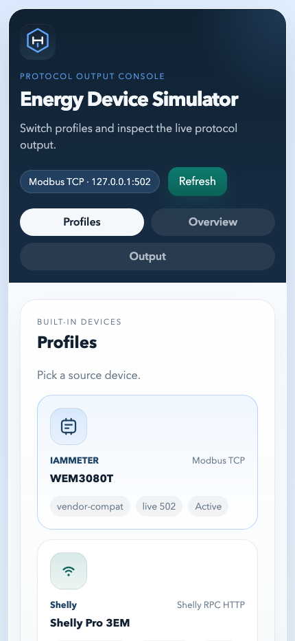

# Energy Device Simulator

An open-source project by [EnergyMeterHub](https://www.energymeterhub.com), built to help developers test energy-meter integrations locally without needing physical hardware.

`Energy Device Simulator` emulates the protocol output that real devices expose, so you can validate polling, decoding, dashboards, and troubleshooting flows against a predictable local target.

Current built-in profiles:

| Profile | Transport | Default dev port | Use case |
| --- | --- | ---: | --- |
| `IAMMETER WEM3080T` | Modbus TCP | `1502` via `npm start` | Test raw register polling and IAMMETER-compatible integrations |
| `Shelly Pro 3EM` | Shelly local RPC HTTP | `18080` | Test local RPC consumers and payload handling |

## Why this project exists

- develop and debug integrations without a live meter on your desk
- reproduce vendor-style protocol output locally
- switch quickly between built-in device profiles from a small web console
- inspect connection details, payload previews, and live protocol behavior
- automate test or demo setups with a local HTTP control API

## What you get

- a local web console for switching profiles and inspecting protocol output
- a small HTTP control API for discovery, mutation, and fault injection
- built-in device profiles and JSON config examples
- a bundled Modbus meter reader for the IAMMETER profile
- deterministic tests with `node:test`

## Quick Start

Requirements:

- Node.js `22.6.0` or newer

Install, verify, and start the default simulator:

```bash
npm install
npm run typecheck
npm test
npm start
```

`npm start` uses the non-privileged IAMMETER dev config at [`examples/devices/iammeter-wem3080t.dev.json`](examples/devices/iammeter-wem3080t.dev.json), so a fresh clone can run without needing port `502`.

Then open:

```text
http://127.0.0.1:5092/
```

What you will see right away:

- built-in profile cards for IAMMETER and Shelly
- the active device summary and connection details
- a live protocol output preview
- terminal-side request logs for low-level debugging

## Screenshots

README screenshots live under [`docs/readme`](docs/readme) so they stay versioned with the repo, remain reusable outside GitHub, and stay separate from the simulator's runtime static assets.

Desktop overview of the local console:



Mobile view of the same local UI:



## Startup Modes

Safe local startup:

```bash
npm start
```

This starts `IAMMETER WEM3080T` on port `1502`.

Realistic IAMMETER startup:

```bash
npm run start:iammeter
```

This uses the built-in IAMMETER profile on port `502`, which may require elevated privileges on some systems.

Shelly startup:

```bash
npm run start:shelly
```

This starts `Shelly Pro 3EM` on port `18080`.

## CLI

```bash
node --experimental-strip-types src/cli.ts start
node --experimental-strip-types src/cli.ts start iammeter-wem3080t
node --experimental-strip-types src/cli.ts start examples/devices/iammeter-wem3080t.dev.json
node --experimental-strip-types src/cli.ts start shelly-3em
node --experimental-strip-types src/cli.ts validate
node --experimental-strip-types src/cli.ts read-meter --host 127.0.0.1 --port 1502 --unit 1 --profile iammeter-wem3080t
```

Available package scripts:

- `npm start`
- `npm run dev`
- `npm run start:iammeter`
- `npm run start:iammeter:dev`
- `npm run start:shelly`
- `npm run read:meter`
- `npm run validate`
- `npm run validate:iammeter`
- `npm run validate:iammeter:dev`
- `npm run validate:shelly`
- `npm run typecheck`
- `npm test`

## Config Layout

Shared system settings live under [`examples/system`](examples/system):

- `default.json`

Device examples live under [`examples/devices`](examples/devices):

- `iammeter-wem3080t.json`
- `iammeter-wem3080t.dev.json`
- `shelly-3em.json`

The simulator expects:

- one shared system config
- one device config file

## Built-in Profiles

Built-in device behavior and protocol definitions live in [`src/profiles/builtin.ts`](src/profiles/builtin.ts).

Current profiles:

- `IAMMETER WEM3080T`
  Raw Modbus TCP holding registers at `0-64`, with changing phase power and total power.
- `Shelly Pro 3EM`
  Shelly RPC HTTP endpoints `/rpc/EM.GetStatus?id=0` and `/rpc/EMData.GetStatus?id=0`.

## Device Selection State

The simulator remembers the last selected built-in device across restarts.

- only the selected device profile is persisted
- runtime state files are written under `.runtime/`
- runtime state files are ignored by git

## HTTP API

Health and discovery:

- `GET /health`
- `GET /api/devices`
- `GET /api/profiles`
- `GET /api/scenarios`

Per-device inspection:

- `GET /api/devices/:id`
- `GET /api/devices/:id/registers`
- `GET /api/devices/:id/faults`

Per-device mutation:

- `POST /api/device/switch`
- `POST /api/devices/:id/entries/set`
- `POST /api/devices/:id/registers/write`
- `POST /api/devices/:id/faults/apply`
- `POST /api/devices/:id/faults/clear`
- `POST /api/devices/:id/reset`

UI helpers:

- `GET /api/dashboard`
- `GET /api/traffic`

## Meter Reader

The project includes a TypeScript Modbus TCP reader for the built-in IAMMETER profile.

If you started the safe local config:

```bash
npm run read:meter -- --port 1502
```

If you started the realistic IAMMETER profile on `502`:

```bash
npm run read:meter
```

JSON output is also supported:

```bash
node --experimental-strip-types src/cli.ts read-meter --port 1502 --json
```

## Testing

Run:

```bash
npm run typecheck
npm test
npm run validate
npm run validate:iammeter
npm run validate:iammeter:dev
npm run validate:shelly
```

## Project Origin

This repository is an official open-source project from [EnergyMeterHub](https://www.energymeterhub.com), the site that publishes practical smart-energy guides, device research, and related tooling.

## Reference Notes

- Shelly Pro 3EM protocol review: [`docs/shelly-3em-protocol-review.md`](docs/shelly-3em-protocol-review.md)
